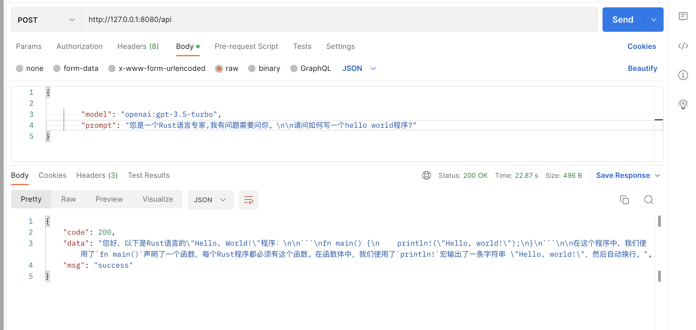
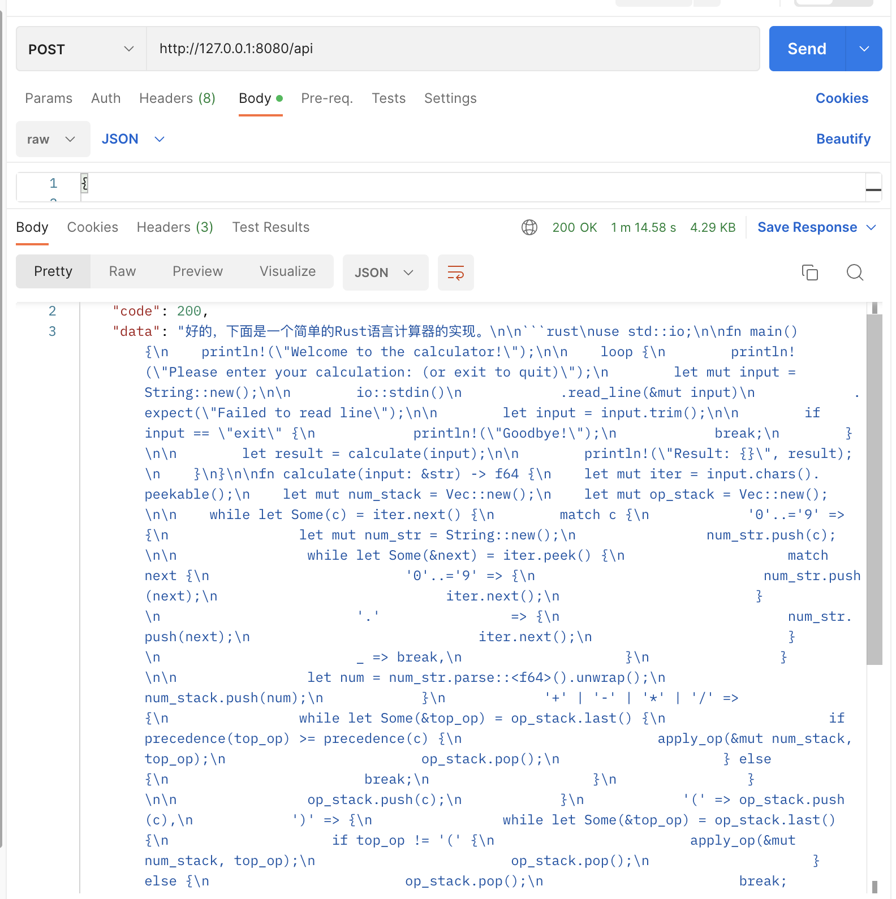

# free chatgpt


无需账号即可免费无限次数使用的chatgpt api, 通过[Vercel AI Playground](https://play.vercel.ai/)实现。

- 优点: 免费, 无需账号, 支持多个模型。
- 缺点: 不是很快, 不太稳定。

- 

- vercel单个api仅支持256个token,通过多次请求合并上下文支持超过1024个token。

## 安装

- `docker run -itd -p 8080:8080 --name=free-chatgpt classmatelin/free-chatgpt:latest`.

如需使用proxy, 则添加环境变量:
```
SOCKS_PROXY: "socks5:x.x.x.x:x"
HTTP_PROXY: "https://x.x.x.x:x"
HTTPS_PROXY: "https://x.x.x.x:x"
```
例如: `docker run -itd -p 8080:8080 -e SOCKS_PROXY="socks5:192.168.123.88:1080" --name=free-chatgpt classmatelin/free-chatgpt:latest`.
## 使用

```
curl --silent --location --request POST 'http://127.0.0.1:8080/api' \
--header 'Content-Type: application/json' \
--data-raw '{
 
        "model": "openai:gpt-3.5-turbo",
        "prompt": "您是一个Rust语言专家,我有问题需要问你。\n\n请问如何写一个hello world程序?"
}'
```


### 参数说明

|参数|必填|描述|
|--|--|---|
|model|N|默认: openai:gpt-3.5-turbo.|
|temperature|N|默认:1|
|topP|N|默认:1|
|frequencyPenalty|N|默认：0|
|presence_penalty|N|默认:0|
|stop_sequences|N|默认:[]|

### 支持模型

- anthropic:claude-instant-v1
- anthropic:claude-v1
- replicate:replicate/alpaca-7b
- replicate:stability-ai/stablelm-tuned-alpha-7b
- huggingface:bigscience/bloomz
- huggingface:google/flan-t5-xxl
- huggingface:google/flan-ul2
- cohere:command-medium-nightly
- cohere:command-xlarge-nightly
- openai:gpt-3.5-turbo
- openai:text-ada-001
- openai:text-babbage-001
- openai:text-curie-001
- openai:text-davinci-002
- openai:text-davinci-003


**默认使用openai:gpt-3.5-turbo**